# Diagnostic-Management-System

## A Simple Diagnostic Management System using Django

# https://diagnostic.herokuapp.com/

#### This Project isn't Open Source.If you really need this for learning purposes, then mail me: revelyusuf109@gmail.com
#### if you want to buy it, then knock me:  https://www.facebook.com/RevelYusuf, https://www.linkedin.com/in/abu-yusuf-042591116/

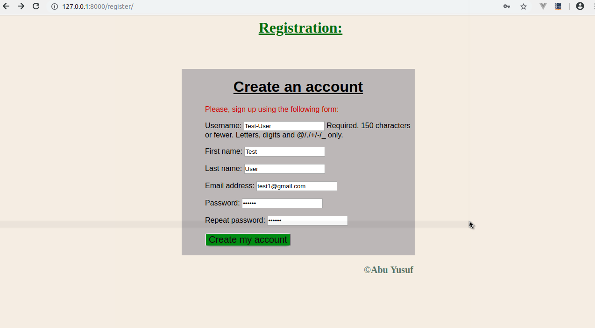

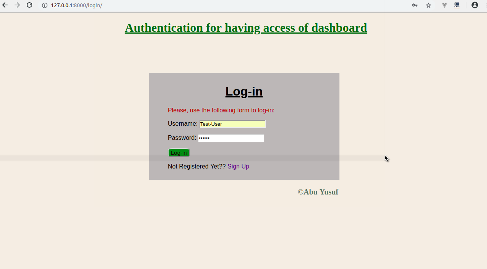
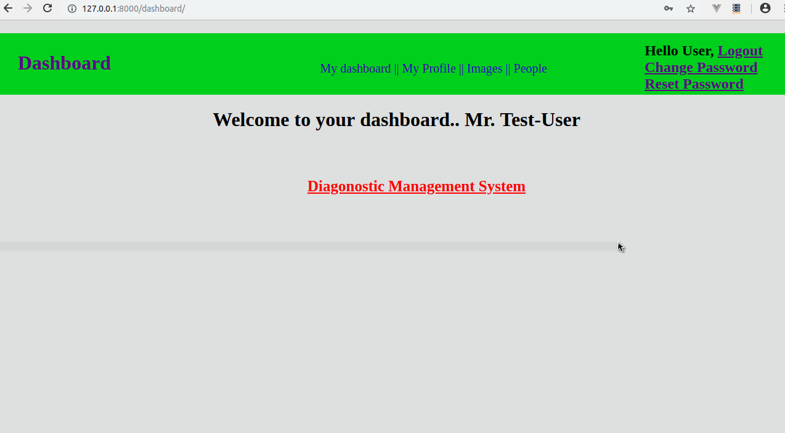
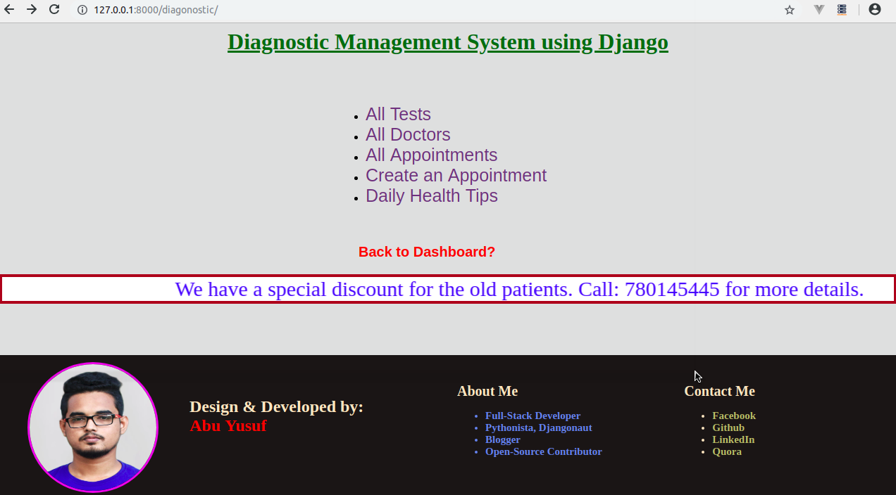
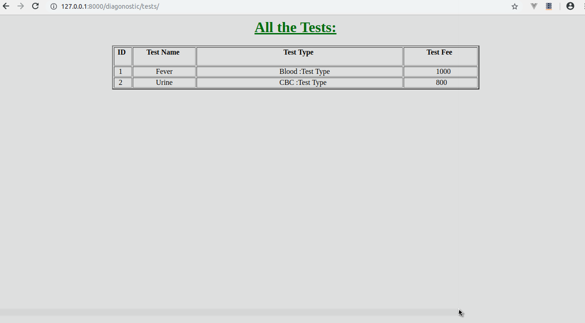
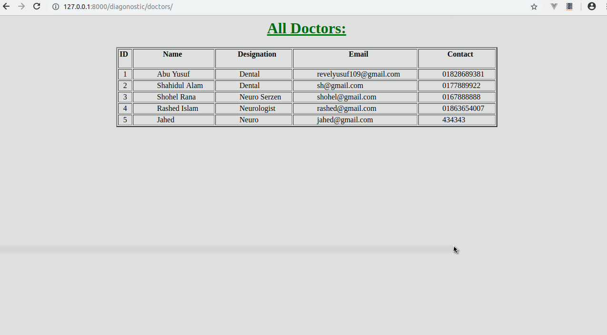
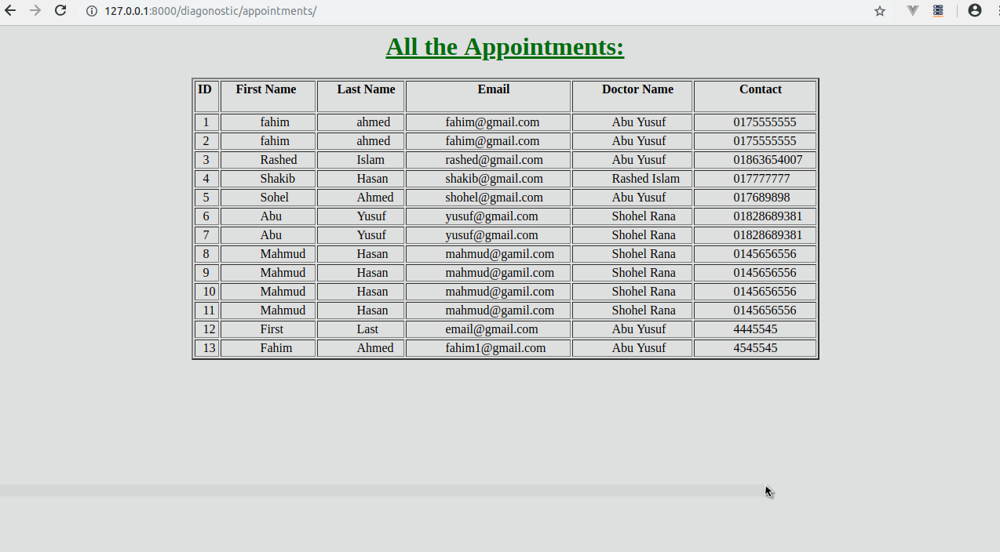
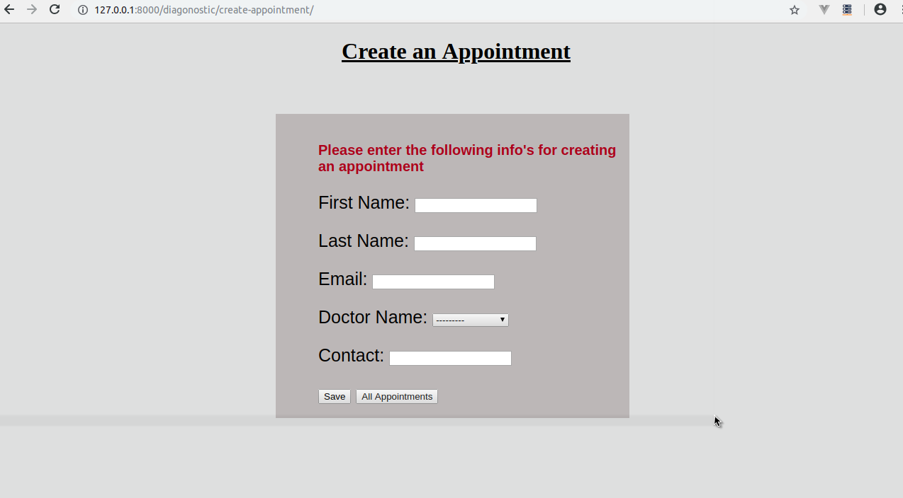
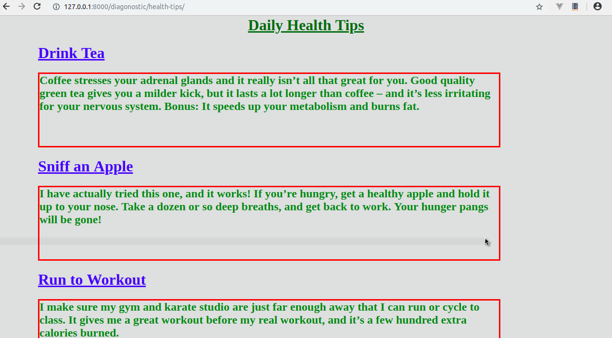
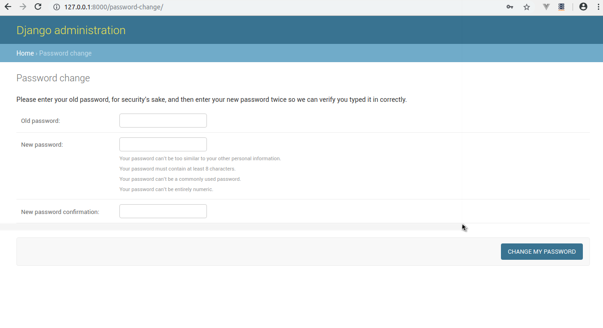
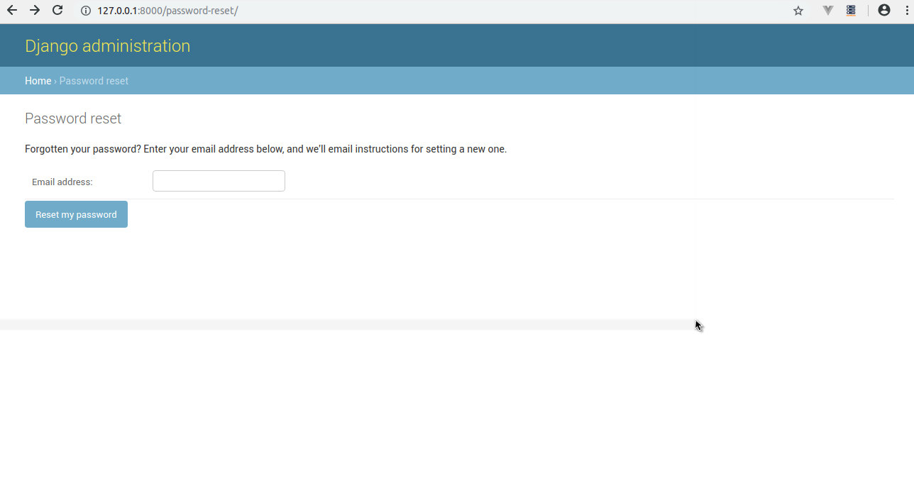

